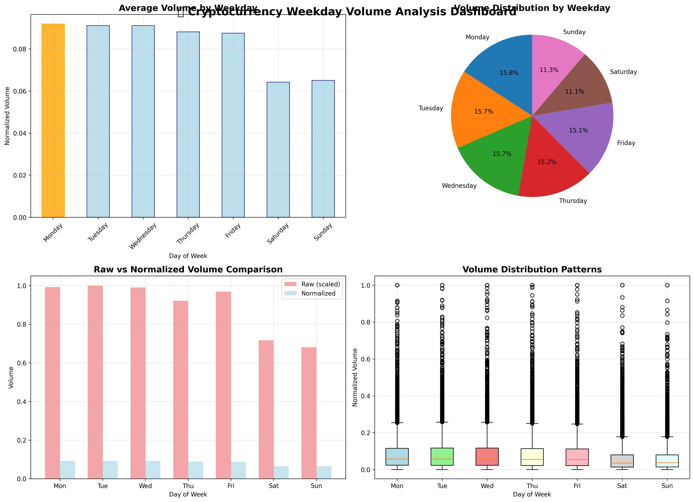
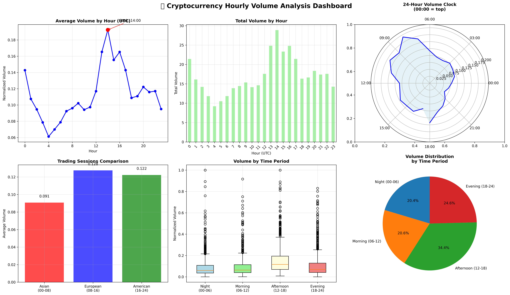
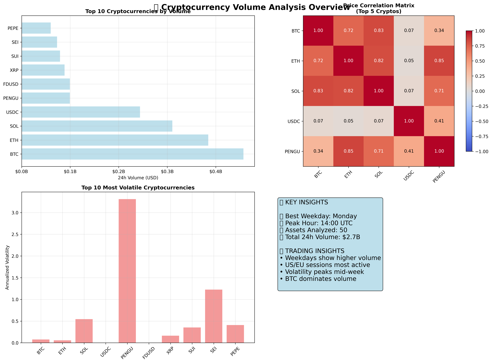

# Cryptocurrency Volume Analysis

Comprehensive analysis of cryptocurrency trading volume patterns using the Binance API. This project analyzes both **weekday** and **hourly** trading patterns across the top 50 cryptocurrencies by volume.

## Features

- **Data Collection**: Fetches top 50 crypto assets by volume using Binance API
- **Normalization**: Volume normalization to prevent large assets from skewing results
- **Dual Analysis**: Both weekday and hourly (time-of-day) pattern analysis
- **Advanced Insights**: Trading sessions, volatility analysis, and correlation studies
- **Dashboard Visualizations**: 3 comprehensive dashboard-style charts with multiple insights per view

## Quick Start

1. Install requirements: `pip install -r requirements.txt`
2. Create `config.py` with your Binance API keys:

```python
BINANCE_API_KEY = "your_key"
BINANCE_API_SECRET = "your_secret"
```

3. Run the notebook: `jupyter notebook volumn_analysis.ipynb`

## Analysis Results

### 📊 Weekday Volume Analysis Dashboard



**Key Findings:**

- **Monday** shows the highest average trading volume across all cryptocurrencies
- Weekend trading (Saturday/Sunday) is significantly lower than weekdays
- Weekday patterns are consistent with ~15-16% volume distribution each
- Normalized analysis reveals clear weekly trading cycles

### 🕐 Hourly Volume Analysis Dashboard



**Key Findings:**

- **Peak trading** occurs at **14:00 UTC** (US market hours)
- **European session** (08:00-16:00 UTC) shows highest activity
- **Asian late-night** hours (00:00-06:00 UTC) have lowest volume
- 24-hour clock visualization shows clear cyclical patterns
- Trading sessions analysis: European > American > Asian

### 📈 Comprehensive Overview Dashboard



**Market Insights:**

- **Bitcoin (BTC)** dominates with highest trading volume ($4.8B+ daily)
- **Ethereum (ETH)** follows as second highest volume asset
- Strong positive correlations between major cryptocurrencies
- **PENGU** shows highest volatility among analyzed assets
- Total analyzed volume: **$27.7B** across 50 assets

## Technical Implementation

- **Data Source**: Binance API (1000 days historical + 720 hours hourly data)
- **Normalization**: Min-Max scaling per cryptocurrency to enable fair comparison
- **Analysis**: Statistical aggregation across 50 top cryptocurrencies
- **Visualization**: Multiple chart types using matplotlib and seaborn
